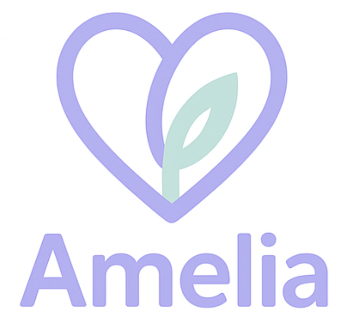

<div align="center">

# Amelia: AI Psychotherapy Companion



*Built for Hackathon Bogotá 2025 - Best Agentic App in WhatsApp Track*


</div>

---

## 💬 **¡Chatea con Amelia ahora!**

<div align="center">

### 🌟 **Experimenta el futuro del cuidado mental** 🌟

**¿Listo para conocer a Amelia? Tu compañera de terapia está a un mensaje de distancia.**

[](https://wa.me/573105775035)

📱 **WhatsApp:** [wa.me/573105775035](https://wa.me/573105775035)

*Disponible 24/7 • Conversaciones en español • Apoyo entre sesiones*

</div>

---

Amelia is an innovative AI companion designed to support psychotherapy patients during the critical period between sessions. By leveraging WhatsApp's 92% penetration rate in Latam, Amelia bridges the gap where 70-80% of patients traditionally abandon therapy after their first session.

## 🎯 Project Overview

### The Problem
- **70-80% therapy dropout rate** between first and second sessions
- **Critical void** in patient support between therapeutic appointments  
- **Lost therapeutic continuity** due to lack of inter-session monitoring
- **Therapist workload** from incomplete patient context at follow-up sessions

### The Solution
Amelia provides:
- **Daily compassionate check-ins** via WhatsApp
- **Crisis intervention** using structured A-B-C logging
- **Automated insight extraction** for therapists
- **Continuous therapeutic support** without replacing professional care

## 🏗️ System Architecture

### Core Components

```
┌─────────────────┐    ┌──────────────────┐    ┌─────────────────┐
│   WhatsApp      │    │     Amelia       │    │   Therapist     │
│   Interface     │◄──►│   AI Agent       │◄──►│   Dashboard     │
│                 │    │                  │    │                 │
└─────────────────┘    └──────────────────┘    └─────────────────┘
         │                        │                        │
         │                        ▼                        │
         │              ┌──────────────────┐              │
         │              │   PostgreSQL     │              │
         └─────────────►│   Database       │◄─────────────┘
                        │                  │
                        └──────────────────┘
                                 │
                                 ▼
                        ┌──────────────────┐
                        │  AI Workflows    │
                        │  (Insight        │
                        │   Processing)    │
                        └──────────────────┘
```

## 🤖 Amelia AI Agent

### Conversational Modes
- **Friend Mode (1-3)**: Supportive listening with minimal structure
- **Balanced Mode (4-6)**: Mix of empathetic support and light therapeutic techniques  
- **Therapist Mode (7-10)**: Full structured approach with systematic check-ins

### Core Capabilities

#### 📋 Daily Check-ins ("Termómetro Emocional")
- **SUDS Scale**: Emotional state quantification (1-10)
- **Daily Highlights**: Best and most challenging moments
- **Values Connection**: Actions aligned with personal values (ACT Framework)
- **Somatic Awareness**: Body sensation monitoring

#### 🚨 Crisis Intervention (A-B-C Model)
- **Activator**: Trigger event identification
- **Beliefs**: Automatic thoughts and interpretations
- **Consequences**: Emotional, behavioral, and physical responses
- **Safety Protocols**: Immediate escalation for high-risk situations

### Communication Features
- **Spanish-first** with cultural adaptation
- **Regional customization** based on user location
- **Natural conversation flow** with varied responses
- **Evidence-based frameworks** (CBT, DBT, ACT, Somatic Therapies)

## 🗄️ Database System

### Advanced Auto-Management
- **Smart Conversation Handling**: Automatic timeout-based conversation closure
- **Dynamic Insight Generation**: Automated creation of insights when conversations complete
- **Configurable Parameters**: Flexible timeout settings and insight type management

### Key Tables
```sql
profiles                 -- User accounts (patients/therapists)
conversations           -- Chat sessions with auto-management
messages                -- Individual chat messages
conversation_insights   -- AI-extracted insights
insight_types          -- Configurable insight categories
patient_context        -- Comprehensive patient profiles
```

### Insight Processing
- **Primary Emotions**: Ekman's 6 basic emotions extraction
- **Crisis Classification**: Risk assessment with severity levels
- **Conversational Summary**: Key events and developments
- **Mood Classification**: Emotional state tracking over time

## 🌐 Frontend Dashboard

### Next.js Application Features
- **Patient Selection**: Multi-patient therapist interface
- **Date Range Analysis**: Flexible reporting periods
- **Real-time Metrics**:
  - Total conversations
  - Crisis events count
  - Average mood scores  
  - Patient engagement rates
- **Interactive Charts**: Visual insights and trend analysis
- **Patient Summaries**: AI-generated key insights

### Technology Stack
- **Framework**: Next.js 15 with React 19
- **UI Components**: Radix UI + Tailwind CSS
- **State Management**: TanStack Query
- **Charts**: Recharts
- **Authentication**: Supabase Auth

## 🔄 AI Workflow System

### Insight Processing Pipeline

```
Conversation Complete → Insights Created → AI Processing → Results Stored
                                           │
                            ┌──────────────┴──────────────┐
                            ▼                             ▼
                   ┌─────────────────┐          ┌─────────────────┐
                   │  Primary        │          │  Crisis         │
                   │  Emotions       │          │  Classification │
                   └─────────────────┘          └─────────────────┘
                            │                             │
                            ▼                             ▼
                   ┌─────────────────┐          ┌─────────────────┐
                   │  Conversational │          │  Mood           │
                   │  Summary        │          │  Classification │
                   └─────────────────┘          └─────────────────┘
```

### Processing Types
1. **Primary Emotions**: Ekman's 6 basic emotions with intensity ratings
2. **Crisis Classification**: ABC model analysis with severity assessment
3. **Conversational Summary**: Key events and developments extraction
4. **Mood Classification**: Emotional state quantification

### Workflow Configuration
- **Flexible Prompts**: Markdown-based LLM instructions
- **JSON Schemas**: Structured output validation
- **Example Templates**: Quality assurance references
- **Configurable Types**: Dynamic insight category management

## 📁 Project Structure

```
├── database/                 # PostgreSQL schema and migrations
│   ├── functions/           # Database functions
│   ├── triggers/           # Auto-management triggers
│   └── examples/           # Sample data
├── front/                   # Next.js dashboard application
│   ├── app/                # App router pages
│   ├── components/         # Reusable UI components
│   ├── models/             # Database interaction classes
│   └── types/              # TypeScript definitions
├── workflows/               # AI processing configurations
│   └── raw_insights/       # Insight extraction prompts
├── prompts/                # Amelia conversational prompts
├── examples/               # Sample user profiles and data
└── doc/                    # Documentation and pitch materials
```

## 🚀 Getting Started

### Prerequisites
- Node.js 18+
- PostgreSQL 14+
- Supabase account
- WhatsApp Business API (for production)

### Database Setup
```bash
# Apply migrations in order
cd database/
# Follow MIGRATION_ORDER.md for proper sequence
```

### Frontend Development
```bash
cd front/
pnpm install
pnpm dev
```

### Environment Configuration
```bash
# .env.local
NEXT_PUBLIC_SUPABASE_URL=your_supabase_url
NEXT_PUBLIC_SUPABASE_PUBLISHABLE_KEY=your_anon_key
```

## 🎯 Hackathon Achievements

### Innovation & Impact
- **Addresses Critical Gap**: 70-80% therapy dropout prevention
- **Cultural Relevance**: WhatsApp-first approach for Latin America
- **Evidence-Based**: Integrates proven therapeutic frameworks
- **Scalable Solution**: Can serve multiple patients per therapist

### Technical Execution
- **Advanced Database**: Auto-management and insight processing
- **Sophisticated AI**: Multi-modal conversational agent
- **Modern Stack**: Next.js, TypeScript, Supabase integration
- **Workflow Automation**: Configurable AI processing pipelines

### Market Viability
- **Proven Demand**: Mental health crisis and therapy accessibility issues
- **Clear Value Proposition**: Improved patient retention and outcomes
- **Monetization Path**: SaaS model for therapy practices
- **Regulatory Compliance**: Designed with healthcare privacy in mind

## 📊 Key Metrics & Impact

### For Patients
- **Continuous Support**: 24/7 availability between sessions
- **Crisis Management**: Immediate intervention capabilities
- **Progress Tracking**: Mood and engagement monitoring
- **Cultural Adaptation**: Localized communication styles

### For Therapists
- **Enhanced Context**: Rich pre-session patient insights
- **Risk Assessment**: Automated crisis detection
- **Workload Reduction**: Automated data collection and analysis
- **Better Outcomes**: Improved patient retention and engagement

## 🔮 Future Enhancements

### Planned Features
- **Voice Integration**: Audio message processing
- **Predictive Analytics**: Early warning systems
- **Group Support**: Peer connection features
- **Integration APIs**: EMR system connectivity

### Scalability Considerations
- **Multi-language Support**: Expansion beyond Spanish
- **Regional Adaptation**: Country-specific mental health frameworks
- **Professional Network**: Multi-practice deployment
- **Research Platform**: Anonymized data insights

## 🏆 Competition Positioning

**Track**: Best Agentic App in WhatsApp  
**Unique Value**: First AI companion specifically designed for inter-session psychotherapy support with comprehensive therapist dashboard and automated insight generation.

**Competitive Advantages**:
- WhatsApp-native experience (92% penetration in Latam)
- Evidence-based therapeutic approaches
- Automated professional-grade insights
- Crisis intervention capabilities
- Cultural and linguistic adaptation

---

## 🚀 **¿Listo para transformar el cuidado mental?**

<div align="center">

### 💚 **Amelia está esperando para apoyarte**

**No dejes que el espacio entre sesiones sea un vacío. Convierte cada día en una oportunidad de crecimiento.**

[](https://wa.me/573105775035)

📞 **Contacto directo:** [wa.me/573105775035](https://wa.me/573105775035)

*🌎 Disponible en toda Latinoamérica • 🇪🇸 Conversaciones en español • 🤝 Apoyo profesional continuo*

---

### 🏆 **Hackathon Bogotá 2025**
*Built with ❤️ for mental health transformation*

**🎯 Misión:** *Empowering mental health care through intelligent conversation*  
**💡 Visión:** *Therapy doesn't end when your session does*


*Porque cada conversación puede cambiar una vida* 💜

</div>

